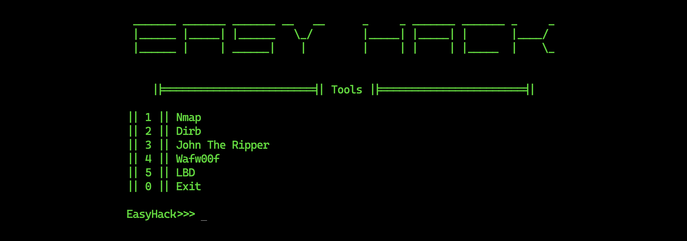
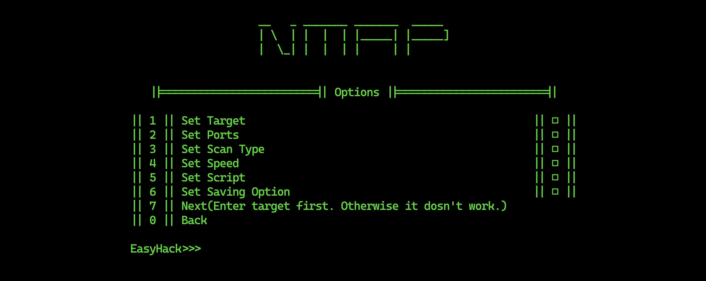
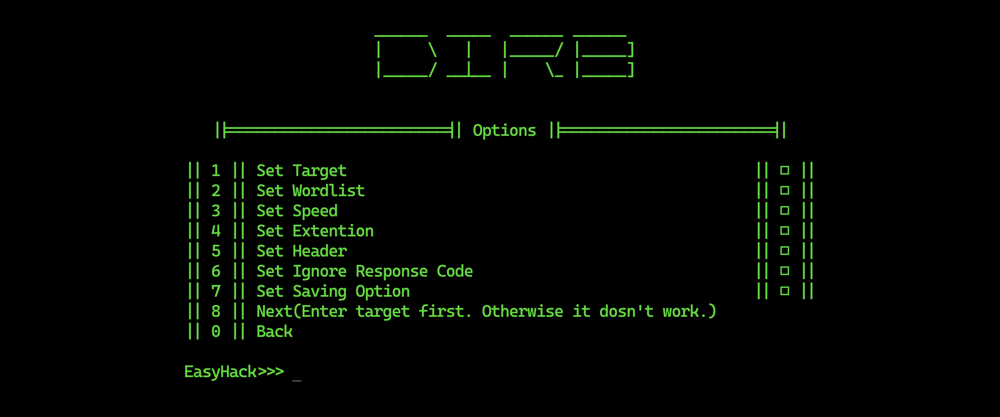
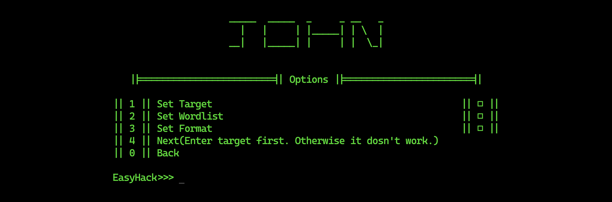
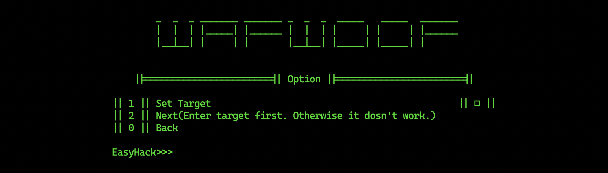
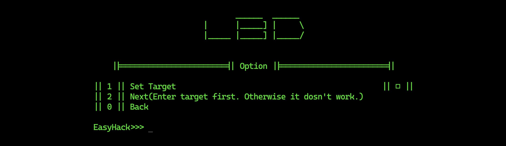

# EasyHack

<p align="center">
    
</p>

---

* [About](#about)
* [Platform](#platform)
* [Features](#features)
* [Tools](#tools)
    + [Nmap](#nmap)
    + [Dirb](#dirb)
    + [John The Ripper](#john-the-ripper)
    + [WafW00f](#wafw00f)
    + [LBD](#lbd)
* [Download & Setup](#download--setup)
* [Run](#run)
* [Documentation](#documentation)
* [ProjectMembers](#project-members)

## About

**EasyHack** is a project aimed at simplifying the management of penetration testing tools through a command-line interface (CLI). Penetration testers often work with various tools like nmap, John the Ripper, Dirb, LBD, and IP changers. **EasyHack** provides a centralized and efficient platform to manage and utilize these tools, addressing the growing need for effective cybersecurity solutions. This project responds to the increasing demand for streamlined cybersecurity tools in an ever-evolving threat landscape.

## Platform

Base: Linux, MacOS

Tested On: ParrotOS, MacOS

## Features

* Network exploration, host discovery, and security auditing.
* Recursively scan directories and look for files with different extensions in a web server.
* Password cracking.
* Identify Web Application Firewall (WAF).
* Detects whether a given domain uses DNS and/or HTTP load-balancing.

## Tools

### Nmap

<p align="center">
    
</p>

### Dirb

<p align="center">
    
</p>

### John The Ripper

<p align="center">
    
</p>

### WafW00f

<p align="center">
    
</p>

### LBD

<p align="center">
    
</p>

## Download & Setup

```
git clone https://github.com/Al-Fuad/EasyHack.git
cd EasyHack
gcc setup.c -o setup && ./setup
```

## Run

```
gcc main.c -o main && ./main
```

## Documentation

<a name="_36nmj4xt4iwn"></a><h3>Methodology</h3>

The development of **EasyHack** will follow a structured methodology:

* **Analysis:** Conduct a detailed analysis of existing penetration testing tools and their command-line requirements.

* **Design:** Create a robust system architecture for **EasyHack**, ensuring efficient tool management through the command line.

* **Development:** Implement the command-line interface, tool library, and configuration features.

* **Integration:** Explore opportunities for command-line integration with other cybersecurity frameworks and tools.

* **Testing:** Rigorously test the command-line application to ensure reliability, security, and usability.

* **Documentation:** Develop comprehensive and user-friendly command-line documentation and guides.

* **Ethical Considerations:** Address ethical considerations regarding responsible tool usage within the console-based environment.